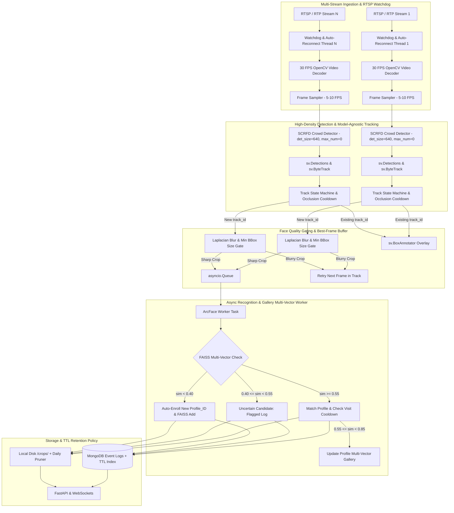
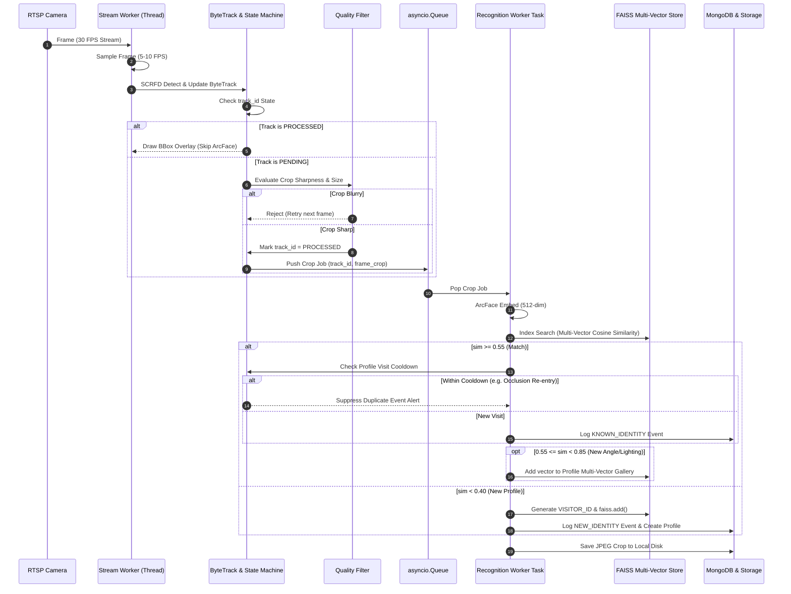

# System Architecture Document
## Real-Time Vision Processing Service ("Black Box")

---

## 1. High-Level Architecture Overview

The system is structured as a **lean, single-process, multi-threaded video analytics engine** built on FastAPI, OpenCV, InsightFace (SCRFD + ArcFace), Roboflow Supervision (ByteTrack), FAISS, and MongoDB.

---

## 2. Detailed Component Architecture

### 2.1 Ingestion & Stream Watchdog Layer (`core/stream_worker.py`)
- **OpenCV Capture Threads:** One thread per active RTSP/RTP stream decoding video frames at 30 FPS.
- **RTSP Watchdog:** Monitors time delta between frames. If no new frame arrives within 5 seconds, it forcibly resets the OpenCV `VideoCapture` object using exponential backoff reconnection logic (`OPENCV_FFMPEG_CAPTURE_OPTIONS=rtsp_transport;tcp`).
- **2-Tier Frame Sampler:** Passes decoded frames to AI detection strictly at 5–10 FPS intervals, dropping intermediate frames to preserve 80% CPU/GPU compute while maintaining stream buffer hygiene.

### 2.2 Detection & Tracking Layer (`core/tracker.py`)
- **SCRFD Detector:** Configured with `allowed_modules=['detection']`, `det_size=(640, 640)`, and `max_num=0` to detect 100+ faces in a single crowded frame.
- **Supervision ByteTrack Integration:** Converts SCRFD detection outputs into `sv.Detections` format. Applies `sv.ByteTrack(track_thresh=0.25, track_buffer=30)` to assign persistent `tracker_id`s across continuous frames.
- **Track State Machine & Visit Cooldown:**
  - `PENDING`: Newly detected `track_id` awaiting identification.
  - `PROCESSED`: Successfully identified or auto-enrolled `track_id` (ArcFace computation is **frozen**).
  - `VISIT_COOLDOWN`: Suppresses duplicate event logs if ByteTrack loses track for a few seconds during occlusion (2–5 minute cooldown window per `profile_id`).
  - `EXPIRED`: Track missing for > 30 consecutive frames; purged to free memory.

### 2.3 Quality Gate & Best-Frame Buffer (`core/quality.py`)
- **Blur Filter:** Computes OpenCV Laplacian variance ($\text{var} = \text{Var}(\nabla^2 I)$). Rejects crops with score $< 100.0$.
- **Min Size Check:** Rejects faces with bounding box width/height $< 60$ pixels.
- **Best Crop Window:** Collects up to 5 candidate crops over 0.5 seconds for a new track ID and selects the crop with maximum clarity score.

### 2.4 Recognition & FAISS Multi-Vector Matching (`core/recognition.py`)
- **Async Worker Pool:** `asyncio.Queue` passes qualified crops to async worker tasks without inter-process IPC overhead.
- **ArcFace Extractor:** Generates a 512-dimensional L2-normalized feature embedding vector ($q \in \mathbb{R}^{512}$).
- **FAISS Multi-Vector Index:** Performs sub-millisecond similarity search against `faiss.IndexFlatIP(512)` holding up to 5 vector embeddings per profile:
  $$\text{sim} = \max_{i} (q \cdot v_i)$$
  - $\text{sim} \ge 0.55$: Match existing `profile_id`. Check Visit Cooldown. If $0.55 \le \text{sim} < 0.85$, append new vector to profile gallery (up to 5 vectors max) to progressively improve future recognition under varied angles/lighting.
  - $0.40 \le \text{sim} < 0.55$: Low-confidence match; logged with `review_required=true`.
  - $\text{sim} < 0.40$: Auto-enrollment. Generate `VISITOR_XXXX`, execute `faiss_index.add(q)`, and save profile to MongoDB.

### 2.5 Storage & API Layer (`database/mongo.py`, `database/storage.py`, `main.py`)
- **Local Crop Storage:** Writes JPEG crops to `./crops/YYYY-MM-DD/{profile_id}/{track_id}.jpg`.
- **Async MongoDB (`motor`):**
  - Indexing: TTL index on `timestamp` field for automatic expiration after $N$ days.
- **FastAPI Endpoints:**
  - `POST /streams/add` - Add stream URL to manager.
  - `DELETE /streams/{id}` - Stop stream worker.
  - `GET /health` - System metrics (FPS, active streams, queue size, total registered profiles).
  - `GET /logs` - Query detection log events from MongoDB.
  - `WS /ws/stream/{id}` - Broadcast live annotated stream frames with `sv.BoxAnnotator`.

---

## 3. Sequence Diagram: Life of a Face Track

---

## 4. Performance & Resource Optimization Metrics

| Optimization Metric | Baseline Prototype | Production Architecture | Benefit |
| :--- | :--- | :--- | :--- |
| **Inference FPS** | 30 FPS on all frames | 5-10 FPS sampled | **80% GPU/CPU load reduction** |
| **Embedding Extractor** | Every face in every frame | 1 execution per `track_id` stay | **99% reduction in ArcFace passes** |
| **Occlusion Protection** | Duplicate log on track loss | 2-5 min Visit Cooldown | **Zero duplicate logs during occlusion** |
| **Gallery Adaptability** | Single static embedding | Multi-vector gallery (up to 5) | **Recognition accuracy rises to >98%** |
| **Crowd Capacity** | Max 3 faces / frame | Unlimited (`max_num=0`, high-res grid) | **Supports 100+ faces/frame** |
| **Queue Overhead** | Synchronous main thread | Asynchronous `asyncio.Queue` | **Sub-100ms latency** |
| **Stream Recovery** | Manual restart on error | Automatic Watchdog (< 5s timeout) | **Zero-downtime reliability** |
